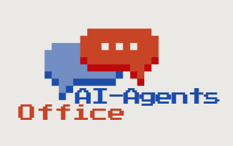

<p align="center">
  
</p>

<h1 align="center">AI-Agents Office</h1>

<p align="center">
  像素風格虛擬辦公室 — 將 Claude Code AI 代理視覺化為動畫角色
</p>

<p align="center">
  <a href="#功能">功能</a> · <a href="#快速開始">快速開始</a> · <a href="#架構">架構</a> · <a href="#技術棧">技術棧</a>
</p>

---

基於 Pablo de Lucca 的 [Pixel Agents VS Code 擴充套件](https://github.com/pablodelucca/pixel-agents)，本專案改為以 Web Server + 瀏覽器的方式運作，不依賴 VS Code，可搭配任何編輯器或終端機使用。

## 功能

### 核心

- **一個代理一個角色** — 每個 Claude Code 工作階段都有專屬的像素動畫角色
- **即時活動追蹤** — 角色會根據代理的實際操作做出對應動畫（寫程式時打字、讀檔案時閱讀、等待時閒置）
- **子代理視覺化** — Task 工具產生的子代理會以獨立角色出現，並與父代理連結
- **最多 21 個代理** — 辦公室同時支援最多 21 個角色

### 互動

- **對話泡泡** — 需要權限時顯示琥珀色泡泡、處理中顯示動態思考泡泡、完成時顯示綠色打勾
- **思考氣泡** — 角色頭頂即時顯示 AI 的工作內容摘要，含打字機效果
- **聊天整合** — 透過內建聊天面板傳送訊息給代理，支援 Markdown 渲染
- **音效通知** — 代理完成工作或收到聊天訊息時播放提示音

### 辦公室自訂

- **版面編輯器** — 可自由調整辦公室佈局，放置牆壁、地板、家具
- **80+ 像素家具** — 桌椅、書架、盆栽、螢幕、白板等豐富家具選擇
- **靜態背景** — 支援自訂 PNG 辦公室背景圖
- **多元角色** — 6 種調色盤搭配自動色相偏移，確保每個角色外觀獨特

### 團隊協作

- **多階段專案管理** — 技術長自動分配任務給 PM、架構師、設計師、前後端工程師等角色
- **專案作品集** — 瀏覽過往專案、查看任務流程和完成度、預覽 AI 產出的文件
- **即時面試** — 與 AI 角色即時對話互動

## 架構

```
ai-agents-office/
  server/     Express + WebSocket 伺服器（監聽 Claude Code JSONL 紀錄檔）
  client/     React + Vite 前端（Canvas 渲染像素風格辦公室）
```

- **Server** 監聯 `~/.claude/projects/` 下的 Claude Code JSONL 紀錄檔，偵測工具使用、代理狀態變更及權限請求，透過 WebSocket 即時廣播給前端。
- **Client** 在 HTML Canvas 上渲染像素風格辦公室及動畫角色。角色即時反映代理活動 — 寫程式時打字、搜尋檔案時閱讀、等待時閒置。

## 環境需求

- Node.js 18+
- [Claude Code CLI](https://docs.anthropic.com/en/docs/claude-code) 已安裝並設定完成

## 快速開始

```bash
git clone https://github.com/pettyferlern/pixel-agents-2.git
cd pixel-agents-2
npm install
npm run dev
```

這會同時啟動伺服器（port 3000）和 Vite 開發伺服器。在瀏覽器開啟 Vite 顯示的網址即可。

### 正式建置

```bash
npm run build
npm start
```

## 運作原理

Server 監聽 `~/.claude/projects/` 下 Claude Code 的 JSONL 紀錄檔，追蹤每個代理的動作。當代理使用工具（寫檔案、執行指令、搜尋程式碼），Server 會偵測到並透過 WebSocket 將更新廣播到瀏覽器前端。

Client 執行遊戲迴圈，包含 Canvas 渲染、角色狀態機（閒置/走路/打字/閱讀）、以及可調整縮放等級的像素完美精靈圖渲染。角色的出現與離開帶有 Matrix 風格的特效動畫。

## 技術棧

- **Server**: TypeScript, Express, WebSocket (ws), chokidar, pngjs
- **Client**: React 19, TypeScript, Vite, Canvas 2D, react-markdown

## 授權

本專案採用 [MIT License](LICENSE) 授權。
